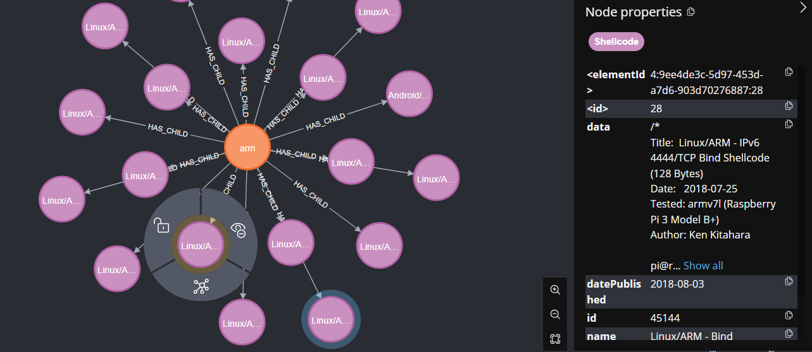

# ExploitDB Shellcode Database with Neo4j

🚀 **Welcome to the ExploitDB Shellcode Database Application**! This project is a Go-based application that uses Neo4j to store and manage all shellcodes from [ExploitDB's API](https://www.exploit-db.com/). The primary purpose of this tool is to support **cyber threat intelligence** workflows by providing an efficient way to query and manage shellcodes based on their architecture.

---

## Features

✨ **Key Functionalities:**

1. **List Architectures**: Retrieve all architectures stored in the database.
2. **List Shellcodes by Architecture**: Get shellcodes based on a specific architecture.
3. **Load Data**: Populate the database with data from ExploitDB's API.

---

## How It Works

The application provides three main HTTP endpoints to interact with the data:

1. **`GET /architectures`**
   - Description: Lists all architectures in the database.
   - Example Response:
     ```json
     [{"id":"bsd_x86","name":"bsd_x86","shellcodes":null},{"id":"freebsd","name":"freebsd","shellcodes":null}]
     ```

2. **`GET /architectures/{id}/shellcodes`**
   - Description: Retrieves shellcodes for a specific architecture.
   - Example Response:
     ```json
     [
       {
         "id": "123",
         "name": "Linux/x86 - Shell Reverse TCP",
         "date_published":"2009-04-13",
         "data":"/*\n\nELF - FreeBSD Execve /bin/sh - Anti-Debugging - i386/AMD64\n\nc0d3_z3r0 \u003c anderson_underground@hotmail.com ; andersonc0d3@gmail.com \u003e\n\nhttp://anderson.hacknroll.com\nhttp://blog.hacknroll.com\n\n\\x7f\\x45\\x4c\\x4"
       }
     ]
     ```

3. **`POST /load-data`**
   - Description: Populates the Neo4j database by pulling data from ExploitDB's API. This is the first call you should make to initialize the system.

---

## Installation

1. **Clone the repository:**
   ```bash
   git clone https://github.com/by2waysprojects/shellcode-db.git
   cd shellcode-db
   ```

2. **Set up Neo4j:**
   - Install Neo4j from [here](https://neo4j.com/download/).
   - Start the Neo4j service and configure the connection details (username, password).

3. **Set environment variables:**
   - Create a `.env` file:
     ```env
     NEO4J_DB=bolt://localhost:7687
     NEO4J_USER=neo4j
     NEO4J_PASSWORD=yourpassword
     SERVER_PORT=8080
     ```

4. **Build and run the application:**
   ```bash
   go build -o cmd/main ./cmd/
   ./cmd/main
   ```

---

## Usage

1. **Start the server:**
   ```bash
   ./cmd/main
   ```

2. **Use the API endpoints:**
   - Use tools like `curl` or Postman to interact with the API.

   Example commands:
   ```bash
   # Load data into the database
   curl -X POST http://localhost:8080/load-data

   # List all architectures
   curl http://localhost:8080/architectures

   # Get shellcodes for a specific architecture
   curl http://localhost:8080/architectures/{id}/shellcodes
   ```

---

## Database Graph Visualization

Below is an example of the graph representation of the data stored in Neo4j:



This image demonstrates the relationships between architectures (e.g., `arm`) and their associated shellcodes. The connections labeled `HAS_CHILD` indicate the hierarchical organization of the shellcodes under a specific architecture.

---

## How It Works (Behind the Scenes)

1. The application initializes a connection to Neo4j and sets up a RESTful HTTP server using the Go `net/http` package and a router (like `gorilla/mux`).
2. **Endpoint responsibilities:**
   - `GET /architectures`: Queries Neo4j for distinct architectures stored in the database.
   - `GET /architectures/{id}/shellcodes`: Fetches shellcodes associated with a specific architecture ID.
   - `POST /load-data`: Uses ExploitDB's API to fetch and store shellcodes and their metadata into Neo4j.
3. All data is organized and queried efficiently using Neo4j's graph database capabilities.

---

## License

This project is licensed under the Apache-2.0 License. See the `LICENSE` file for details.

---

## Contribution

🤝 Contributions are welcome! Please feel free to submit issues or pull requests to enhance the application.

---

## Acknowledgments

❤️ Special thanks to the team at [ExploitDB](https://www.exploit-db.com/) for providing an excellent resource for security researchers worldwide.